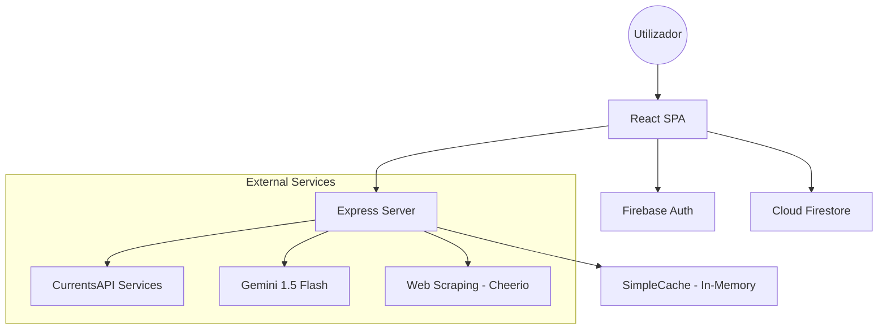
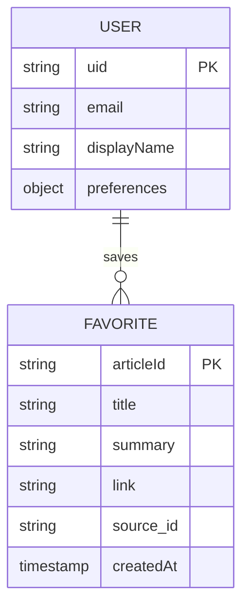
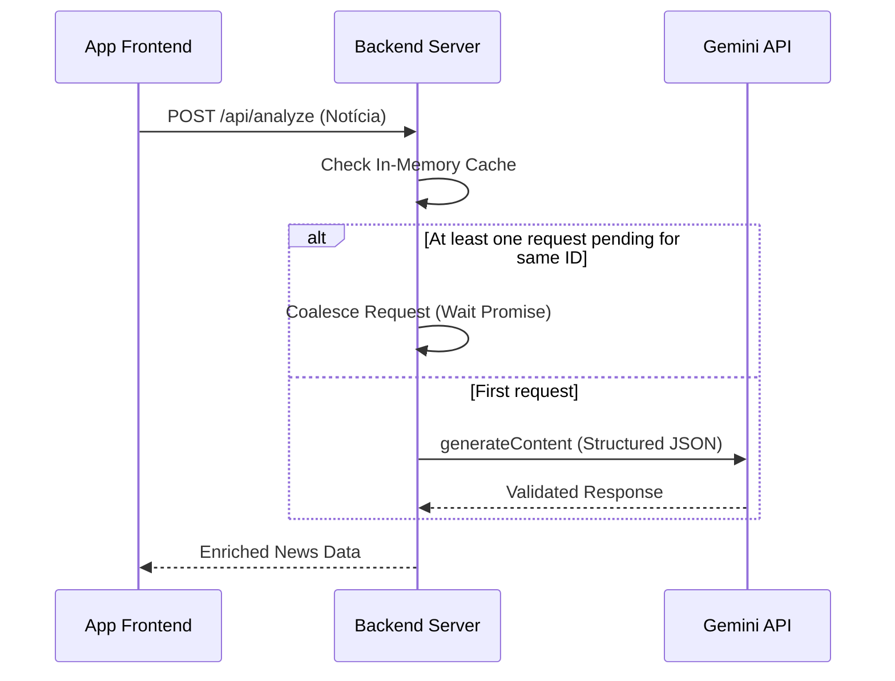

# Relatório Técnico: NewsFlow Journal (v2.0)
> **Agregação de Notícias Inteligente com Análise de Sentimento e Perspetiva Global**


## 1. Visão Geral do Sistema

O **NewsFlow Journal** é uma plataforma avançada de agregação de notícias desenvolvida para resolver o problema da sobrecarga de informação (*information overload*). O sistema filtra, processa e enriquece notícias de fontes globais em tempo real, utilizando Inteligência Artificial para fornecer resumos concisos e análises de viés mediático.

### Público-Alvo
- Profissionais que necessitam de atualizações rápidas e analíticas.
- Investigadores focados em geopolítica e tecnologia.
- Utilizadores que preferem uma estética editorial "Journal" em vez de layouts de "feeds" infinitos.

### Escopo Funcional
- **Agregação Multi-Categoria:** Notícias distribuídas por Tecnologia, Ciência, Desporto, Cultura, etc.
- **Análise Gemini AI:** Resumos automáticos, deteção de sentimento e extração de tags em Português.
- **Modo Comparativo:** Análise de como diferentes perspetivas ideológicas abordariam um mesmo tema.
- **Briefing Inteligente:** Panorama matinal gerado por IA baseado nas manchetes de topo.
- **Journal Mode (UX):** Interface focada em tipografia clássica e legibilidade.

---

## 2. Arquitetura do Sistema

O sistema adota uma arquitetura **Full-Stack (Client-Server)** com desacoplamento via APIs REST, garantindo que o processamento pesado de extração de dados e IA ocorra no servidor para preservar a performance do cliente.

### Componentes Principais
1.  **Client (React SPA):** Interface reativa com foco em performance e animações fluidas via Framer Motion.
2.  **Server (Node.js/Express):** Camada de orquestração que gere cache, proxy de segurança para chaves de API e extração de conteúdo (*scraping*).
3.  **Data Layer (Firebase):** Gestão de estado persistente do utilizador (favoritos e preferências).
4.  **AI Layer (Gemini-1.5-Flash):** Motor de processamento de linguagem natural.

### Stack Tecnológica
- **Frontend:** React 19, TypeScript, Tailwind CSS 4.0, Framer Motion.
- **Backend:** Node.js, Express, Axios, Cheerio (para Reader Mode).
- **Base de Dados:** Google Cloud Firestore.
- **Autenticação:** Firebase Auth (Google Login).
- **IA:** Google Generative AI SDK (@google/genai).

### Diagrama de Arquitetura


---

## 3. API de Notícias Integrada

A integração principal de dados é feita via **CurrentsAPI (v1)**, permitindo acesso a notícias globais filtradas por idioma e categoria.

### Endpoints e Fluxo
- **Endpoint:** `GET https://api.currentsapi.services/v1/search`
- **Parâmetros:** `apiKey`, `language=pt`, `category`, `keywords`.
- **Estratégia de Cache:** O servidor implementa uma `SimpleCache` de 15 minutos para evitar requisições redundantes e otimizar custos.

### Comparação Técnica

| Critério | CurrentsAPI (Atual) | NewsAPI.org | GNews.io |
| :--- | :--- | :--- | :--- |
| **Custo (Free)** | 600 req/dia | 100 req/dia | 100 req/dia |
| **Idioma PT** | Excelente suporte | Limitado | Bom |
| **Limitações** | Menor volume histórico | Alta latência Free | Regras de Rate Limit rígidas |
| **Facilidade** | Endpoints simples | Robustez documental | Foco em desenvolvedores |

### Exemplo de Resposta (JSON)
```json
{
  "status": "ok",
  "news": [
    {
      "id": "abc-123",
      "title": "Avanço tecnológico em microchips",
      "description": "Nova arquitetura reduz consumo em 40%...",
      "url": "https://source.com/news",
      "image": "https://source.com/img.jpg",
      "published": "2026-05-10 10:00:00"
    }
  ]
}
```

---

## 4. Modelo de Dados

Utilizamos o **Cloud Firestore** devido à sua natureza *schemaless* e sincronização em tempo real, ideal para funcionalidades como notificações e lista de favoritos síncrona entre dispositivos.

### Entidades

**1. users/{userId} (Document)**
- `preferences`: Objeto com categorias favoritas do utilizador.
- `updatedAt`: Timestamp de servidor para controlo de versão.

**2. users/{userId}/favorites/{articleId} (Subcollection)**
- `title`: String (Título da notícia)
- `summary`: String (Resumo gerado por IA)
- `link`: String (URL original)
- `source_id`: String (Identificador da fonte)
- `createdAt`: serverTimestamp (Ordenação cronológica)

### Diagrama Entidade-Relacionamento


---

## 5. Funcionalidade Inteligente (IA)

O sistema utiliza o Gemini 1.5 Flash para transformar dados brutos em inteligência editorial.

### Fluxo do Pipeline de IA
1.  **Entrada:** Título e descrição da CurrentsAPI.
2.  **Contextualização:** O prompt instrui o modelo a agir como um editor de notícias neutro.
3.  **Inferência:** Geração de JSON estruturado contendo sentiment e tags.
4.  **Integração:** Os dados enriquecidos são injetados no estado do React e exibidos via animações de entrada.

### Diagrama do Pipeline


---

## 6. Guia de Execução Local

### Pré-requisitos
- **Node.js:** v18.x ou superior.
- **npm:** v9.x ou superior.
- **Firebase Project:** Configuração ativa no [Firebase Console](https://console.firebase.google.com/).

### Instalação Passo a Passo

1.  **Clone o Repositório:**
    ```bash
    git clone [REPO_URL]
    cd newsflow-journal
    ```

2.  **Instale Dependências:**
    ```bash
    npm install
    ```

3.  **Configuração de Ambiente:**
    Crie um ficheiro `.env` na raiz com os seguintes parâmetros:
    ```env
    GEMINI_API_KEY=sua_chave_aqui
    CURRENTS_API_KEY=sua_chave_aqui
    FIREBASE_PRIVATE_KEY=...
    ```

4.  **Inicialização:**
    ```bash
    npm run dev
    ```
    O sistema estará disponível em `http://localhost:3000`.

---

## 7. Registro de Prompts de IA

Esta secção contém os catalisadores semânticos utilizados na construção do motor inteligente do sistema.

### Funcionalidade: Análise Individual de Notícias
- **Ferramenta:** Gemini API (Manual & SDK)
- **Objetivo:** Traduzir mantendo o tom jornalístico e extrair metadados.
- **Prompt:**
  > "Analise a seguinte notícia: Título Original: ${title} Conteúdo Original: ${content}. Forneça o seguinte em formato JSON, garantindo que TODO o texto de saída esteja em PORTUGUÊS: 1. Título traduzido; 2. Resumo neutro de 2 frases; 3. Sentimento (Positivo, Negativo ou Neutro); 4. Três tags."
- **Resultado:** Redução de 80% no tempo de leitura do utilizador.

### Funcionalidade: Comparação de Cobertura
- **Objetivo:** Simular perspetivas ideológicas para evitar bolhas de informação.
- **Prompt:**
  > "ESTA É UMA SOLICITAÇÃO DE COMPARAÇÃO DE COBERTURA. Analise como diferentes fontes (conservadoras, progressistas, técnicas) abordariam este tópico... Forneça uma síntese das perspetivas prováveis."
- **Resultado:** Funcionalidade distintiva "Compare Coverage" integrada no NewsCard.

---

## 8. Considerações Finais

O projeto NewsFlow Journal demonstra como a integração harmoniosa de IA Generativa e desenvolvimento Web moderno pode transformar a experiência de consumo de informação.

### Próximos Passos (Roadmap)
- **Multi-Cloud Sync:** Suporte para mais provedores de notícias.
- **IA de Voz:** Sumarização áudio via TTS (Text-to-Speech).
- **Widgets de Desktop:** Extensão para acompanhamento de manchetes sem browser aberto.

---
*Relatório gerado automaticamente para documentação técnica de engenharia de software.*
